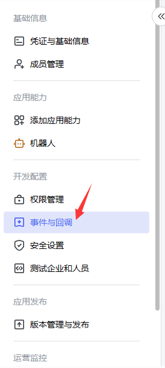
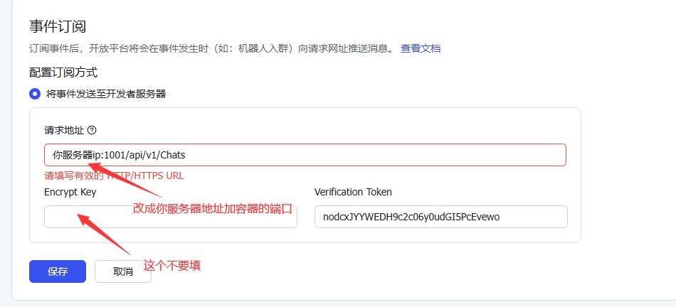
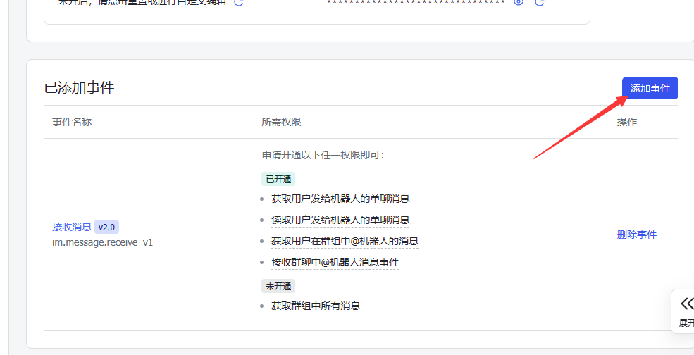
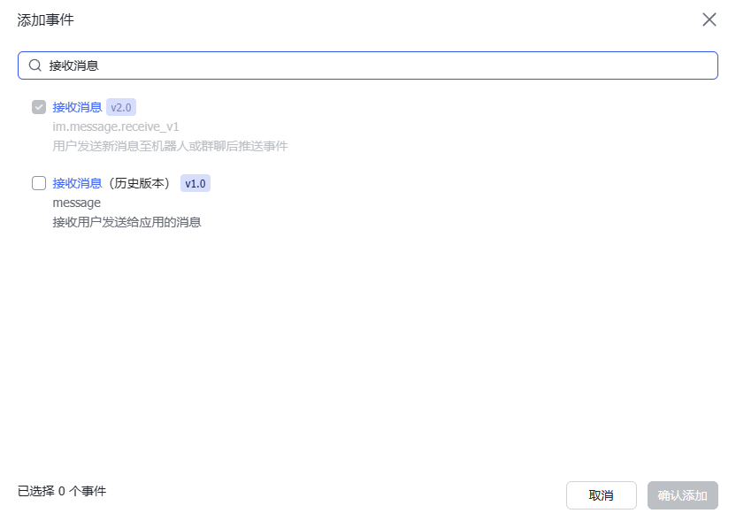
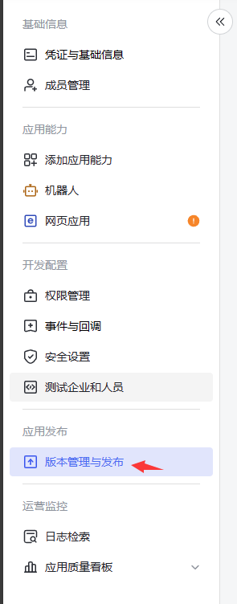
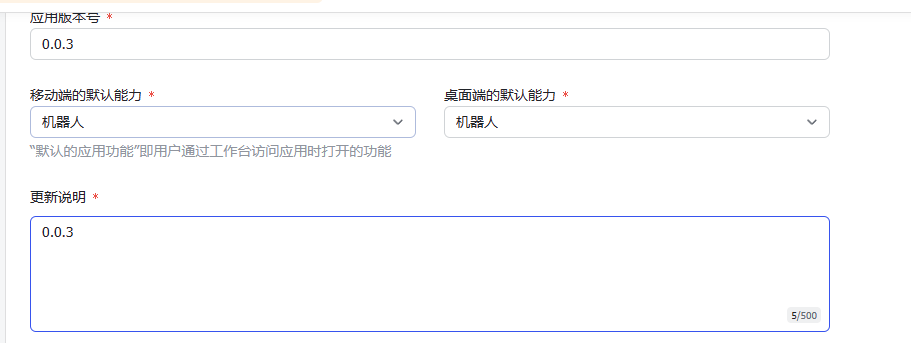
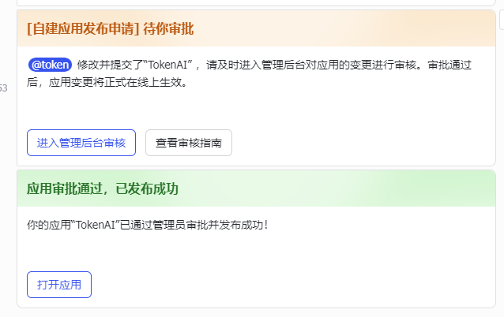
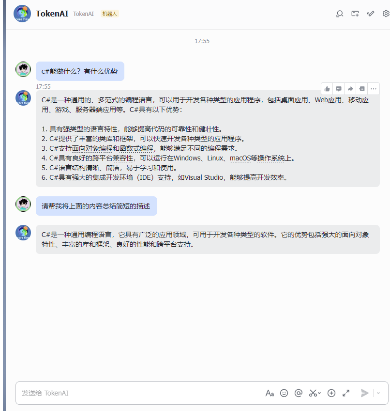

# 飞书AI接入教程

首先，准备俩个账号：ChatGPT账号、飞书账号。

飞书账号请自行注册，访问链接 www.feishu.cn/ 即可登录。

第一步，飞书进入[开发者平台](https://open.feishu.cn/)。点击创建应用。


填写应用名称和描述，还有头像也可以自己修改。


然后点击左边的添加应用，添加机器人。


添加机器人权限：

im:message

im:message.group_at_msg

im:message.group_at_msg:readonly

im:message.p2p_msg

im:message.p2p_msg:readonly

im:message:send_as_bot


然后一件开通权限


然后在你的服务器中启动`FeiShuGpt`项目

```
docker run -d -p 1001:8080 --name=feishu-gpt -e APPID=xxx -e BOTNAME=xx -e APPSECRET=xxx -e GPTKEY=xxx -v ./FeiShuGpt.db:/app/FeiShuGpt.db registry.cn-shenzhen.aliyuncs.com/tokengo/feishu-gpt:latest
```

- 环境变量参数：
  - `APPID` 飞书应用Id
  - `APPSECRET` 飞书应用密钥
  - `GPTKEY` `ChatGptApi`密钥
  - `MODEL`  使用的AI模型为空则使用默认`gpt-3.5-turbo-1106`模型
  - `ENDPOINT` `OpenAI`端点 为空则使用默认
  - `MAXHISTORY` 最大聊天记录数量默认 3
  - `BOTNAME` 机器人名称（在群里使用需要，因为需要判断@的是否为机器人）

然后打开事件于回调



修改回调地址：`http://服务器ip地址:1001/api/v1/Chats`，请注意 `Encrypt Key`不要填。



点击添加事件：



搜索`接收消息` 然后添加 `接收消息 v2.0`



然后打开版本管理与发布，创建版本，输入版本号。





然后保存审核。



然后找到我们的应用



## 结尾

***源码在星球***

加入Token的星球提供技术支持12小时在线回复在线解决问题包括远程协助解决问题。


技术交流群：737776595
